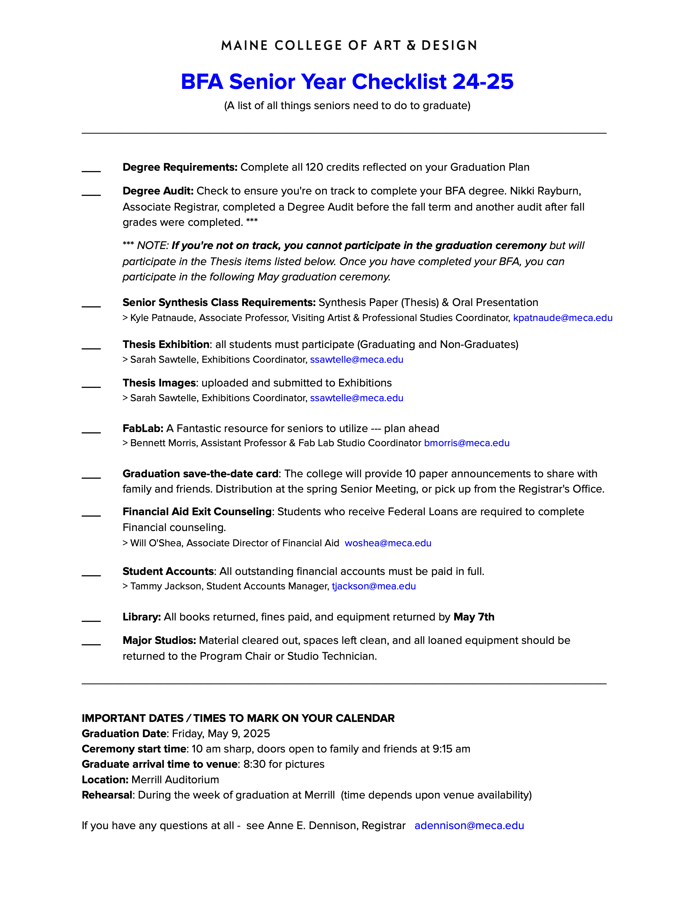

# Thesis Planning 

> #### Canvas Link
> [Canvas](https://meca.instructure.com/)

[Degree Project Overview](https://meca.instructure.com/courses/2280/assignments/syllabus)

> "**Method** of making and research"

Topics of content and topics of design (what you want to do as a designer)

audience 

what is it 
what does it do 
who is it for 
